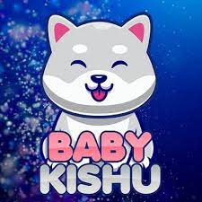

什么是 Baby KishuX 代币？ Baby KishuX 代币是第一个旨在为 MEME 代币建立整个生态系统的项目，Baby KishuX 是一个革命性的去中心化交易所。交易费用将在 Baby KishuX 持有者之间分配第一个 meme 代币的收益农业。质押您的 BabyKishuX 以获得其他 meme 代币。 baby kishux 是一种独一无二的奖励代币，它使用币安智能链上的专有合约。在这一切的中心，目标仍然是创建一个项目，通过创建一个牢不可破的社区基础来为其持有者发出声音。创建一个社区项目是拥抱并认识到力量和成长不是来自一个单一的角度，而是通过创建一个有凝聚力的单元，所有部分的总和汇集在一起​​，使其成为一个整体。有多少 Baby KishuX 代币在流通？在撰写本文时，Baby KishuX 总供应量的 80% 正在流通。总供应量, 10,000,000,000, 营销 1,000,000,000 空投 1,000,000,000 销毁 2,000,000,000 流通 6,000,000,000
