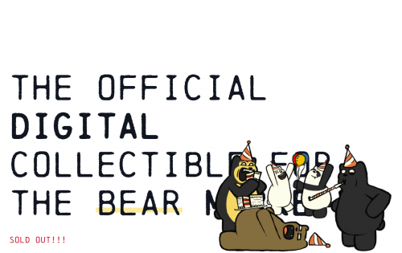
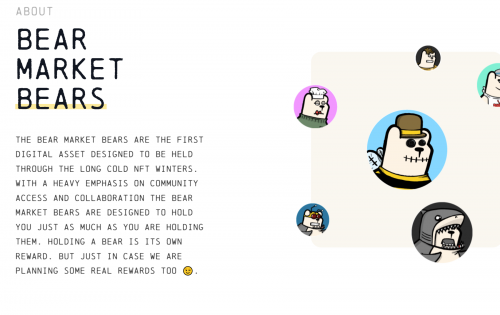

---
title: "BearMarketBears"
description: "Bear Market Bears 是熊市的官方数字收藏品。"
date: 2022-08-14T00:00:00+08:00
lastmod: 2022-08-14T00:00:00+08:00
draft: false
authors: ["crazyxuanshao"]
featuredImage: "bearmarketbears.png"
tags: ["Collectibles","BearMarketBears"]
categories: ["nfts"]
nfts: ["Collectibles"]
blockchain: "ETH"
website: "https://dappradar.com/deeplink/9635"
twitter: "https://twitter.com/bearmarketbears"
discord: "https://discord.com/invite/bearmarketbears"
telegram: ""
github: ""
youtube: ""
twitch: ""
facebook: ""
instagram: ""
reddit: ""
medium: ""
steam: ""
gitbook: ""
googleplay: ""
appstore: ""
status: "Live"
weight: 
lightgallery: true
toc: true
pinned: false
recommend: false
recommend1: false
---

熊市熊市是第一个旨在度过漫长寒冷的 NFT 冬天的数字资产。 Bear Market Bears 非常重视社区访问和协作，旨在让您和您一样拥有它们。 拥有一只熊就是它自己的奖励。 但以防万一我们也在计划一些真正的奖励😉。

###### 稀有度

### **具有社区**投票特征的分层稀有度！ 

社区投票将有助于选择社区希望在完成的项目中看到的特征！分层稀有度或“熊”，将允许收藏家通过背景颜色轻松识别特征和“熊”，而特征仅适用于更高级别的熊！

###### 社区

### Bear Market Bears 是一件紧身针织毛衣。

来参加我们的 discord 并观看绘画课程，并与艺术家一起放松一下 lofi 节拍。参与社区范围的谜题并赢得奖励和 NFT。相互比较和交易熊，找到尖叫着“这就是我，如果我出生并养大一只穿着愚蠢的衣服和属性的熊”的熊。