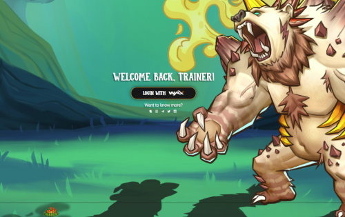
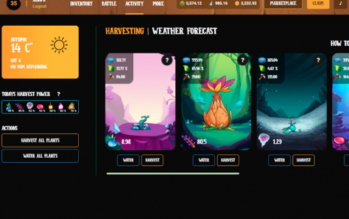

收获、战斗、进化！

野兽花园是 WAX 上的一款战略性怪物战斗游戏。&nbsp;

- 种植您的植物并做出战略性收获决策。 请务必注意天气预报。

- 在 PvE 和 PvP 中与你的对手战斗，以获得我们的代币 BGALPHA。

- 将你的野兽进化成更强大的生物。

在野兽花园中，您需要做出大量明智的战略决策才能取得成功。

我们希望很快能在花园里见到你。 如有任何问题，请随时访问我们的 Discord。

