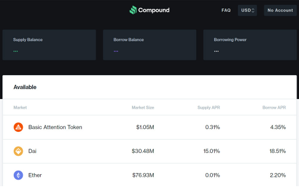
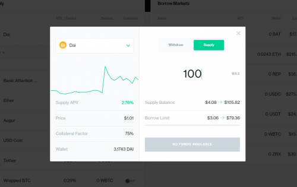

作为以太坊上的第二大应用程序，Compound 是一个为开发人员构建的开源自主协议，用于解锁一系列新的金融应用程序。 利息和借贷，用于开放的金融体系。

# 搭建以太坊开发环境

Compound 协议是一套以太坊智能合约，使软件开发人员能够与加密货币货币市场进行交互。为了从协议中提供或借入资产，您需要写入以太坊区块链。

以太坊是一个去中心化节点的公共网络，它处理交易并将它们附加到一个不断增长的分类账中，这就是所谓的区块链。开发人员可以编写托管在以太坊网络上的称为智能合约的软件。任何有权访问以太坊的人都可以调用对区块链的写入和读取操作。

为了为以太坊创建程序并与 Compound 的智能合约交互，你需要有一个网络接入点，一些智能合约架构的知识，以及一些 JSON RPC 的知识。

