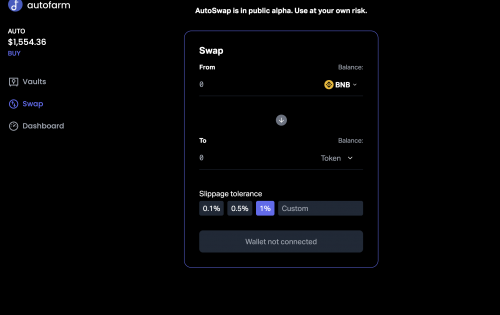
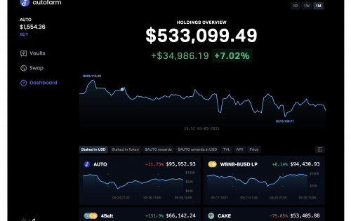

Autofarm 是 BSC、HECO、Polygon、Avalanche、Fantom、Moonriver、OKEx、Celo 和 Cronos（9 条链）拥有 3 种产品作为 Autofarm 生态系统的一部分，即 Vaults（收益优化器）、AutoSwap（DEX 聚合器）和 farmfolio。 收益优化器以最低成本实施最优策略以最大化用户收益，AutoSwap 实施优化以路由用户掉期交易，以便用户找到最佳价格和掉期率。 最后，farmfolio 是一个智能的投资组合管理器和跟踪器，可帮助用户管理他们在各种 DeFi 农业项目中的资产。

AUTO 代币是平台的原生代币，最大供应量为 80,000，没有预售或预农场。 代币经济学是通货紧缩的，AUTO 持有者可以从跨链金库、DEX 聚合器的费用中受益，代币也将用于治理。 分发将于 2021 年 10 月左右结束。

