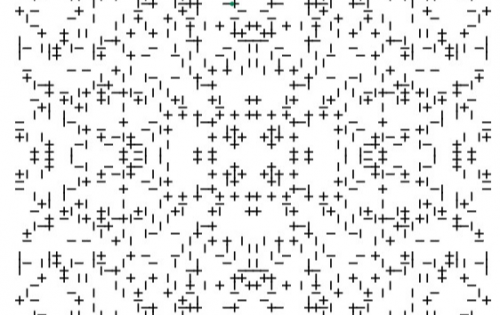
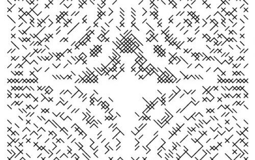

---
title: "Autoglyphs"
description: "Autoglyphs 是以太坊区块链上的第一个“链上”生成艺术."
date: 2022-08-18T00:00:00+08:00
lastmod: 2022-08-18T00:00:00+08:00
draft: false
authors: ["crazyxuanshao"]
featuredImage: "autoglyphs.png"
tags: ["Collectibles","Autoglyphs"]
categories: ["nfts"]
nfts: ["Collectibles"]
blockchain: "ETH"
website: "https://www.larvalabs.com/autoglyphs?utm_source=DappRadar&utm_medium=deeplink&utm_campaign=visit-website"
twitter: "https://twitter.com/larvalabs"
discord: ""
telegram: ""
github: ""
youtube: ""
twitch: ""
facebook: ""
instagram: ""
reddit: ""
medium: ""
steam: ""
gitbook: ""
googleplay: ""
appstore: ""
status: "Live"
weight: 
lightgallery: true
toc: true
pinned: false
recommend: false
recommend1: false

---

Autoglyphs 是生成艺术的一项实验，每一个都是独一无二的，由运行在以太坊区块链上的代码创建。 任何愿意向我们选择的慈善机构 350.org 捐赠 0.20Ξ（398 美元）创建费的人都可以创建一个字形。 字形的创建者也将成为该字形的第一个所有者。 但是，在创建 <strong>512</strong> 个字形之后，生成器将永远关闭自己，并且这些字形只能在二级市场上使用。

现在我们已将项目部署到以太坊，需要注意的是，我们不再控制生成艺术作品的代码，也不再控制管理字形所有权的代码。 这与由艺术家或画廊编辑和销售的艺术有着至关重要的区别。 它允许独立于任何中央机构的所有权、出处和版本大小的长期保证。

### 技术细节

Autoglyphs 是一种高度优化的生成算法，能够创建数十亿个独特的艺术品，包装在 ERC-721 界面中。虽然 ERC-721 是“不可替代代币”（CryptoPunks帮助定义的东西）的标准，但它通常用于管理存储在其他地方的数字项目的所有权。与 Autoglyphs 的主要区别在于，艺术在合约本身之内，它实际上是“区块链上的艺术”。

如果您检查区块链上的任何字形创建交易，这一点就会变得很明显。事件数据包含生成器的完整输出，因此也包含艺术品本身它看起来不像十六进制数据，但它编码了一种字符艺术模式。然后可以按照智能合约本身注释中的 书面说明将这种模式绘制到屏幕甚至纸上。