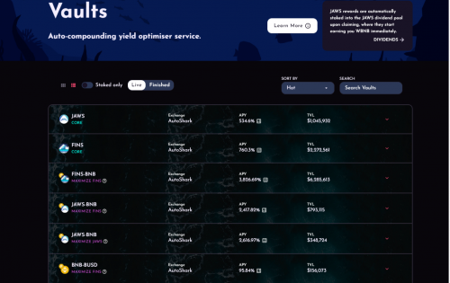
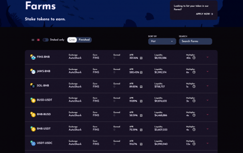

<strong>AutoShark Finance 是第一个混合 AMM 和产量优化器，通过使用卓越的产量策略、自动复合保险库和 NFT 驱动的耕作，提供无与伦比的耕作机会。</strong>

<strong>AutoShark 的目标是在币安智能链上构建排名第一的最可持续的 AMM + DEX 和收益优化器。</strong>

<strong>为此，我们寻求通过整合去中心化交易所掉期系统和收益优化策略来吸引兴趣。</strong>

## 冒险去亚特兰蒂斯

### 以债券和定期存款为特色

Atlantis 是基于 ATLAS 代币的去中心化储备货币协议。每个 ATLAS 代币都由亚特兰蒂斯国库中的一篮子加密货币资产（例如 BUSD、BNB）支持，赋予其不可低于的内在价值。我们还将增加其他较小的市值资产，以使国债投资组合多样化。亚特兰蒂斯还通过质押和绑定将独特的经济和博弈论动态引入市场。

