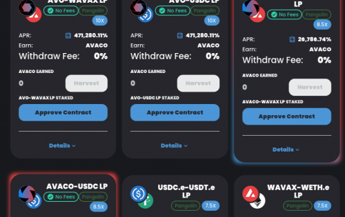

欢迎使用 Avaco.Finance，Avalanche 上的 Yield 协议，具有低排放率和稳定的利润。

Zabu V2克隆

- ⚠️ Masterchef 目前没有时间锁定
- ⚠️ Masterchef 使用每块排放而不是每时间。 这是 Avalanche 网络上的反模式
- ✅ 支持所有转让税代币
- 最高 4% 的提款费，也适用于紧急提款
- 开始块目前估计在 2024 年到达。请与项目说明他们将更新农场开始块。
- 可以更新排放，但前提是开发地址与主厨所有者地址相同
- 额外的 15% 被铸造到开发地址
- 额外的 10% 被铸造到财务地址
- 额外的 20% 直接铸造到销毁地址
- 流动性已锁定一年

