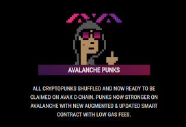

<strong>Avalanche Punks</strong> 是生活在 AVAX 区块链上的 10,000 名朋克的独特集合！ AVAX 系列采用传统朋克属性以及专为 Avalanche 系列设计的独特属性（包括标志性的 Avalanche 橙色背景）制作而成。&nbsp;

Avalanche Punks NFT 系列是限量发行的，成为 Avalanche Punk 持有者后，您对自己的 NFT 拥有完全的所有权。 &nbsp;

