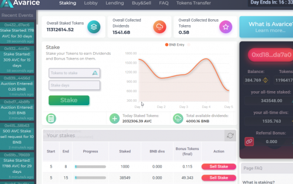
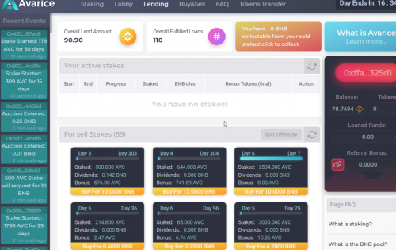

从本质上讲，贪婪意味着贪婪。 这是一个建立在巨人肩膀上的、利润丰厚的 Staking DApp。 从高度成功中汲取灵感

**关于贪婪**
贪婪旨在为质押者提供最大的利益。 用户将在我们易于使用的 dApp 上使用 BNB 购买 AVC 代币。 然后，他们可以质押他们的代币，以赚取在 AVC 中支付的利息以及他们从每日拍卖大厅获得的 BNB 红利份额。 用户可以在最多 300 天的时间内进行任意数量的赌注。 赌注越长，您赚取的利息就越多，同时还能享受赌注红利。 简单的。

