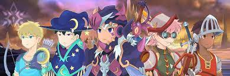
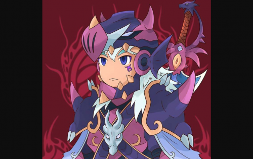

忠诚的骑士、狡猾的弓箭手和奥术法师在 4 个相互冲突的阵营中生成的 8,888 个角色的旅程。

# 介绍

一个新时代的曙光已经来临。为下一波穿上盔甲。

在一个贪婪在商人的城镇、猎人的森林和海盗的水域猖獗的世界里，好与坏之间的界限是善变的。高贵的英雄远离善，恶棍背负着黑暗的历史和误解。但在这片中世纪的 Avarik 土地上，有一件事是显而易见的——每个人都拥有一颗渴望黄金、勇气和荣耀的勇士之心。

穿越艺术和密码学的数字领域，Avarik Saga 的世界从精美的合并中具体化。编织故事，为 Avarik Saga 中的每 8,888 个独特角色注入生命，我们将您带到骑士、巫师和射手的原始和富有想象力的世界。逃离现实的阴郁，您可以改变自己的道德和信仰，并与现实生活中的代币和朋友一起编造一个有价值的冒险故事。在充满活力的伊格尼斯、神秘的泰尼布里斯、仁慈的泰拉和阿瓦里克的流动冰川派系中发现自己并找到自己的家。Avarik Saga 的故事来自你眼中的不同身体。抛开你的疑惑，在 Avarik 的土地上突破想象的天花板，这是一个每个人都有机会的新世界。

# 想象

Avarik Saga 的目标是成为印度尼西亚领先的 NFT 创造者，为其多元化社区打开 P2E（即玩即赚）游戏的大门。作为这一战略冒险的前沿，Avarik Saga 超越了区块链玩家的游戏，成为现代游戏的顶峰，将区块链引入数百万玩家。

利用区块链技术，Avarik Saga 允许玩家通过游戏奖励他们的贡献获得经济利益。玩家可以通过以下方式获得奖励：

1. 招募 Avariks 并在市场上销售。
2. 在 Avark Saga Universe 中参加各种战斗以赢得比赛奖项。
3. 传奇和稀有 Avariks 的集合。
4. 农业实用代币，用于招募和升级 Avariks 的游戏内货币