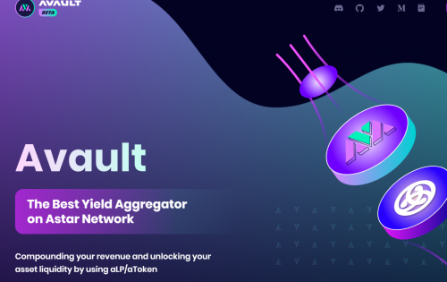
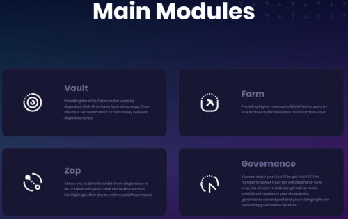

Avault 是一个收益聚合平台，为 DeFi 用户提供 aLP/aToken 自动复利收益。

Avault 还提供了一个带有 ISO 的启动板功能，以帮助重建用户和项目之间的信任

## 主要模块

### 保险库

aLP/aToken 提供给从其他 dapp 存入其 LP 代币的用户。然后，保险库将自动对存入的资金进行再投资。

### 农场

通过质押从保险库收到的 aLP/aToken 为用户提供更高的 $AVAT 收入

### 扎普

让您只需单击一个按钮即可直接从单一资产切换到 LP 代币，而无需转到其他 dex 来切换不同的资产

### 治理

您可以质押您的 $AVAT 以获得 veAVAT。您获得的 veAVAT 数量将取决于您选择锁定多长时间。更长的时间会更多。veAVAT 将代表您在治理奖励池中的份额以及您对即将推出的治理功能的投票权。

