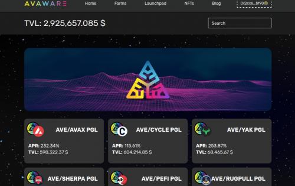
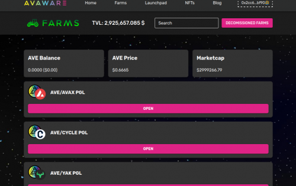

Avaware 提供有竞争力的奖励，让您轻松增加被动收入。 除了运行其首屈一指的 DeFi 应用程序 Avaware.Network，他们还通过构建并继续向 Avaware Network 添加更多优质产品来增加其代币的价值，这些产品包括 Avalanche.Today、Tip.Blue 和 up and 即将到来的 Eneftea.Market

**AVAWARΞ**

Avaware 是建立在 Avalanche 网络之上的 DeFi 平台和项目生态系统。LP 挖矿、NFT 活动、市场和质押。Launchpad 活动、IFO、稳定币等。

我们的主要 DeFi 产品 Avaware.Network 为我们的用户提供了多种赚钱机会。Avaware.Network 是一个平台，将您所有的 DeFi 需求都包含在一个简单易懂的软件包中。我们的目标是构建真正的解决方案，让任何拥有手机的人都可以访问 DeFi 以及围绕它发展的所有东西。

我们为建筑商、投资者和创作者提供广泛的服务。我们围绕经过实战考验和严格审计的 Synthetix StakingRewards.sol 建立了 Avaware 的 LP 矿场，以确保您的资金安全。我们没有让事情变得更复杂，而是采取了相反的方法，并试图让事情变得简单、有用和易于理解。

NFT 部分很灵活，我们可以为我们的合作伙伴处理从简单的 NFT 发布到列入白名单的私人销售的所有事情。我们的稳定代币 AUSD 由一系列稳定币支持，这使我们能够将 NFT 销售与固定金额挂钩。这开辟了套利机会，使我们能够为项目和艺术家等精确筹集资金。

Launchpad 为所有社区成员提供访问权限和透明度，而不仅仅是少数几个。Avaware 的项目组合包括我们可以为合作伙伴、农场和咨询指导利用的营销资产，初始农业产品让用户可以质押 AVE 并获得新项目的代币，因为 Avaware 已经存在近一年了甚至将您的代币分发给任何想参与的人。我们提供空投服务，等等。所有这一切使 Avaware 成为希望在 Avalanche 网络上启动项目的团队的绝佳选择。

