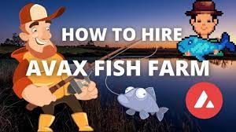

---
title: "AVAX Fish Farm"
description: "雇佣渔民为你捕鱼，每天赚取8%."
date: 2022-08-18T00:00:00+08:00
lastmod: 2022-08-18T00:00:00+08:00
draft: false
authors: ["crazyxuanshao"]
featuredImage: "avax-fish-farm.png"
tags: ["High risk","AVAX Fish Farm"]
categories: ["nfts"]
nfts: ["High risk"]
blockchain: "Avalanche"
website: "https://fishfarm.money/?utm_source=DappRadar&utm_medium=deeplink&utm_campaign=visit-website"
twitter: "https://twitter.com/avaxfishfarm"
discord: ""
telegram: "https://t.me/avaxfishfarm"
github: ""
youtube: ""
twitch: ""
facebook: ""
instagram: ""
reddit: ""
medium: ""
steam: ""
gitbook: ""
googleplay: ""
appstore: ""
status: "Live"
weight: 
lightgallery: true
toc: true
pinned: false
recommend: false
recommend1: false
---

在 Avalanche 链上推出一个可持续的被动收入计划 AVAX Fish Farm🔺

🔥 8% 每日回报

🔥 12.5% 推荐奖金

🔥🔥 押金（雇佣渔民）和索赔（卖鱼）只需 3% 税

🔥🔥🔥🔥 独家功能：复合（重新雇佣渔民）提供 35% 的机会获得 120% 的奖励

**果总是声称（卖鱼）会发生什么？**
**常见问题解答**
(rehirefishers)几个
每天一次还是每天一次？
哪里有我的初始投资？
一直声称会减少你的
奖励作为协议的一部分
抵御更大的投资者
**耗尽合同。**
您的初始投资被锁定并且
不断为你工作，加班
您将获得初始回馈的增量。
多次重新雇用渔民
从本质上增加你的奖励

