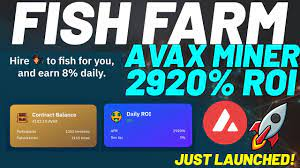

在 Avalanche 链上推出一个可持续的被动收入计划 AVAX Fish Farm🔺

🔥 8% 每日回报

🔥 12.5% 推荐奖金

🔥🔥 押金（雇佣渔民）和索赔（卖鱼）只需 3% 税

🔥🔥🔥🔥 独家功能：复合（重新雇佣渔民）提供 35% 的机会获得 120% 的奖励

**果总是声称（卖鱼）会发生什么？**
**常见问题解答**
(rehirefishers)几个
每天一次还是每天一次？
哪里有我的初始投资？
一直声称会减少你的
奖励作为协议的一部分
抵御更大的投资者
**耗尽合同。**
您的初始投资被锁定并且
不断为你工作，加班
您将获得初始回馈的增量。
多次重新雇用渔民
从本质上增加你的奖励

