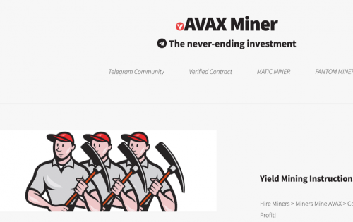

<strong>基于流行的 BNB Miner 项目，带到 Avalanche</strong> 什么是&nbsp;AVAX Miner？

不要将 AVAX Miner 与农场混淆。矿工不是被购买的，而是被雇佣的，因此不能被出售。一旦矿工被雇佣，他们就会无限期地为你工作，以每天 3% 的起始费率为你提供无限量的 AVAX。策略是个人的，你要么严格复合 AKA “雇用更多矿工”，严格把 AVAX 放在口袋里，要么你将两者健康地结合起来。在我们看来，最好的策略是尽可能多地进行复利，同时考虑交易气体。一旦您对每日、每周或每月的结果感到满意，就可以在您认为合适的时候尽可能多地获利，然后继续将其余部分复利。

<u><strong>战略与附加信息：</strong></u>

<u><strong>已验证的公共合同</strong></u>

AVAX Miner 合约是公开的、经过验证的，可以在 AvaxScan 上找到。

AVAX Miner 适用于希望获得长期利润和可持续性的用户。不适合那些想要立即获利的人最终会影响他人。

AVAX Miner 每天支付 3% 的适度费用，让投资者高枕无忧，因为他们知道他们的投资具有无限的增长潜力，并且最大的、不可能的风险低于 3%。

我们的算法允许每个参与者获得丰厚的利润，无论他们的策略如何，但它不会让任何单个参与者比其他参与者拥有不公平的优势。这真是一件美好的事情！

虽然 AVAX Miner 算法确保所有参与者都能获得公平份额的奖励，但它还通过其复合选项又名“雇用更多矿工”来支持最支持的参与者。

<strong>基于流行的 BNB Miner 项目，带到 Avalanche</strong>     
什么是&nbsp;AVAX Miner？

不要将 AVAX Miner 与农场混淆。矿工不是被购买的，而是被雇佣的，因此不能被出售。一旦矿工被雇佣，他们就会无限期地为你工作，以每天 3% 的起始费率为你提供无限量的 AVAX。策略是个人的，你要么严格复合 AKA “雇用更多矿工”，严格把 AVAX 放在口袋里，要么你将两者健康地结合起来。在我们看来，最好的策略是尽可能多地进行复利，同时考虑交易气体。一旦您对每日、每周或每月的结果感到满意，就可以在您认为合适的时候尽可能多地获利，然后继续将其余部分复利。

<u><strong>战略与附加信息：</strong></u>

<u><strong>已验证的公共合同</strong></u>

AVAX Miner 合约是公开的、经过验证的，可以在 AvaxScan 上找到。

AVAX Miner 适用于希望获得长期利润和可持续性的用户。不适合那些想要立即获利的人最终会影响他人。

AVAX Miner 每天支付 3% 的适度费用，让投资者高枕无忧，因为他们知道他们的投资具有无限的增长潜力，并且最大的、不可能的风险低于 3%。

我们的算法允许每个参与者获得丰厚的利润，无论他们的策略如何，但它不会让任何单个参与者比其他参与者拥有不公平的优势。这真是一件美好的事情！

虽然 AVAX Miner 算法确保所有参与者都能获得公平份额的奖励，但它还通过其复合选项又名“雇用更多矿工”来支持最支持的参与者。

