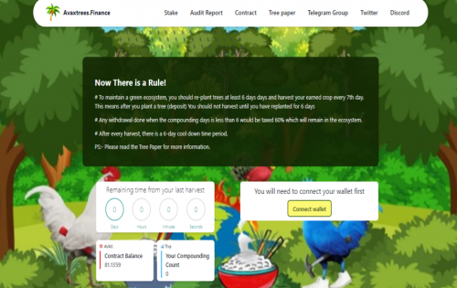
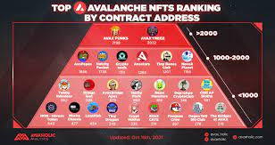

---
title: "AVAX Trees"
description: "第一个支持生态系统的 AVAX Miner。"
date: 2022-08-18T00:00:00+08:00
lastmod: 2022-08-18T00:00:00+08:00
draft: false
authors: ["crazyxuanshao"]
featuredImage: "avax-trees.png"
tags: ["High risk","AVAX Trees"]
categories: ["nfts"]
nfts: ["High risk"]
blockchain: "Avalanche"
website: "https://avaxtrees.finance/?utm_source=DappRadar&utm_medium=deeplink&utm_campaign=visit-website"
twitter: "https://twitter.com/CookedR1ce?t=rs8PW7Mp2jK0WaMOz6GQdQ&s=09"
discord: "https://discord.com/invite/cookedrice"
telegram: "https://t.me/CookRice"
github: ""
youtube: ""
twitch: ""
facebook: ""
instagram: ""
reddit: ""
medium: ""
steam: ""
gitbook: ""
googleplay: ""
appstore: ""
status: "Live"
weight: 
lightgallery: true
toc: true
pinned: false
recommend: false
recommend1: false
---

**现在有一个规则！

<strong>AVAX Trees</strong> 是一个简单的智能合约，它充当 AVAX 奖励池，只要池中还有 AVAX，每天都会返回池中 8% 的 AVAX奖励池！用户可以在积累时选择收获（获取他们的 AVAX 奖励）或重新种植（复合获得的 AVAX 奖励）。

# 为了维持绿色生态系统，您应该至少每天 6 天重新种植树木，每 7 天收获一次收获的作物。这意味着在您种植一棵树（存款）后，您不应该在重新种植 6 天之前收获

<strong>不只是种植数字树木……</strong>&nbsp;

我们所做的是将元诗与艺术和行星生态系统相结合，通过与几个帮助造林和艺术的组织合作，参与者将能够在自己的设计中种植树木，并利用增强现实和卫星图像。更多详细信息请参见树形纸。

<strong>战略与信息</strong>

AVAX Trees 适用于希望获得长期利润和可持续性的用户。对于那些想要立即获利的人来说，最终会影响他人。树木不是买来的，而是租来的，因此不能出售。一旦雇佣了矿工（树木），他们就会无限期地为您工作，以平均每天 8% 的速度为您提供无限量的 AVAX。

