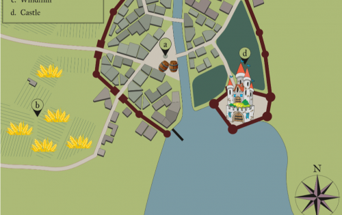
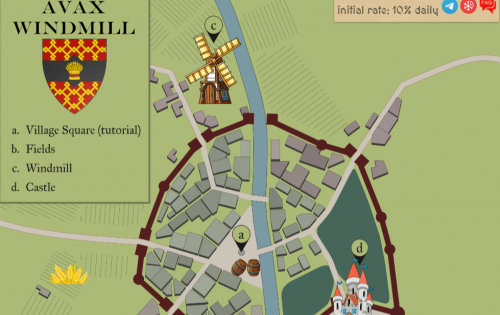

AVAX Windmill 是 Avalanche C-Chain 上的一款中世纪游戏。 您可以收获小麦，然后在风车中生产 AVAX，初始每日回报率为 10%。

游戏的原则是尝试通过在适当的时间再投资于小麦（价格会发生变化）来保持您的回报，以便能够取回您的资金并赚取利润（通过在您想要的时候提取 )。

# 乡村广场

- 步骤 1. 在田间使用 AVAX 收割小麦
- 步骤 2. 您的小麦将逐渐在磨坊中变成面粉，初始比率为每天 10%，然后您可以通过再投资将这种面粉换成小麦以提高您的生产率。
- 第 3 步。或者，您可以在 AVAX 中出售您的面粉，您的风车将无限期地继续生产面粉。
- 您可以随时复利或退出，但建议至少每 24 小时执行一次。

**合约余额：AVAX**