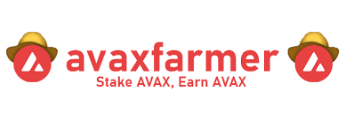
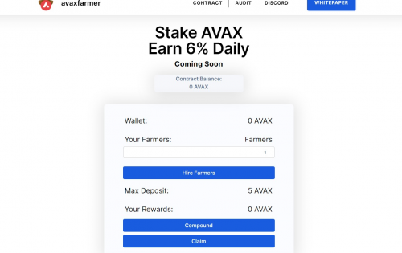

avaxfarmer 是加密货币世界中的一种新协议。该合约充当奖励池，在 24 小时内返还您存入的 AVAX 的 6%。

<strong>avaxfarmer</strong> 对用于保险基金的存款和取款征税。如果合同放缓，该基金将到位，以确保仍在 avaxfarmer 池中的人将继续从中受益。如果需要，这笔资金还将帮助我们补充合同。只要有 AVAX 存入合约，它就会永远自动运行。

存入的资金被锁定在合约中。这意味着一旦您存入代币，就只能通过领取奖励来移除它们。这将有助于延长项目的寿命，并防止用户一次性提取所有资金，从而导致合约余额下降。

在其他项目中，

如果多个用户通过奖励获得了较大的余额，则会导致合约价值出现较大波动，从而无法兑现承诺的百分比。我们的合约有浮动利率，如果正确执行，最高可达 6%。这也确保了合同的寿命。如果合约余额下降，利率将调整以确保所有活跃参与者仍将获得奖励。如果合同余额增加，也会发生同样的情况。

##### 推荐链接和代币经济学

任何使用您的推荐链接的人那里赚取 12% 的用于雇用
农民的 AVAX
！‍ 推荐奖励
将待处理奖励中！请注意：您不能取消质押；只提取收益。‍ 代币经济学**：奖励可以每天重新投资和提取。为了获得全部 8%，我们建议：复利 6 天/周索赔 1 天/周‍ ‍ 费用**在存款和取款期间有效，而不是在复利期间。‍ 每笔存款/取款的基础税为 2.5%。这是为了确保合同的寿命

