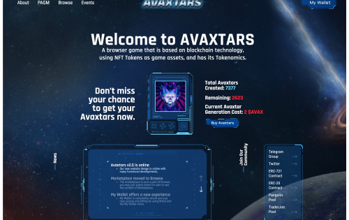
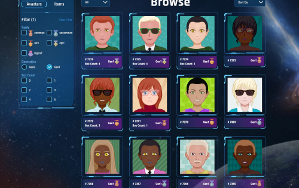

---
title: "Avaxtars"
description: "AVAXTARS 是基于 NFT 的基于 Avalanche 区块链平台的浏览器游戏，并拥有基于 AVXT 代币的自己的代币经济学。"
date: 2022-08-18T00:00:00+08:00
lastmod: 2022-08-18T00:00:00+08:00
draft: false
authors: ["crazyxuanshao"]
featuredImage: "avaxtars.png"
tags: ["NFT Games","Avaxtars"]
categories: ["nfts"]
nfts: ["NFT Games"]
blockchain: "Avalanche"
website: "https://avaxtars.com/?utm_source=DappRadar&utm_medium=deeplink&utm_campaign=visit-website"
twitter: "https://twitter.com/AvaxStars"
discord: "https://discord.com/invite/n266eXd33H"
telegram: "https://t.me/AvaxtarsGlobal"
github: ""
youtube: "https://www.youtube.com/c/AVAXTARS"
twitch: ""
facebook: ""
instagram: ""
reddit: "https://www.reddit.com/r/Avaxtars/"
medium: "https://avaxtars.medium.com/"
steam: ""
gitbook: ""
googleplay: ""
appstore: ""
status: "Live"
weight: 
lightgallery: true
toc: true
pinned: false
recommend: false
recommend1: false
---

<strong>什么是 AVAXTARS？</strong>

AVAXTARS 是基于 NFT 的基于 Avalanche 区块链平台的浏览器游戏。它有自己的基于 $AVXT 代币的代币经济学。

<strong>谁是 AVAXTARS？</strong>

每个 Avaxtar 都是数字生成的头像。 Avaxtar 的图像保存在 IPFS 上，它们的存在作为唯一的 ERC-721 代币记录在 Avalanche 主网上。为了创建 Avaxtar，我们使用数字遗传密码 (DGC) 并创建这些基因的哈希值，因此我们保证所有 Avaxtar 彼此不同。

<strong>我可以用我的 AVAXTAS 做什么？</strong>

创建 Avaxtar 只是伟大冒险的开始。如果您喜欢您的 Avaxtar，您可以保留它，只要您想作为 ERC-721 令牌绑定到您的 Metamask 钱包。

<strong>Avaxtars 路线图</strong>

第 1 阶段于 2021 年 3 月 31 日 18:00 开始

每个人都可以通过支付成本来生成新的 Avaxtar。这些 Avaxtars 是第 1 代 (<strong>Gen1</strong>)，并且可以生成的 <strong>Gen1 Avaxtars</strong> 的最大数量是 <strong>10.000</strong>。

第 2 阶段于 2021 年 6 月 14 日 18:00 开始，使用 AirDrop。

玩家可以使用 <strong>$AVXT 代币</strong>购买“<strong>个人 Avaxtar 生成机 (PAGM)</strong>”。 <strong>PAGM</strong>设备可以生成新的<strong>Gen2 Avaxtars</strong>，玩家可以刷<strong>$AVXT</strong>。

在第 3 阶段，所有 Avaxtar 都可以执行任务、获得经验并达到新的等级。

