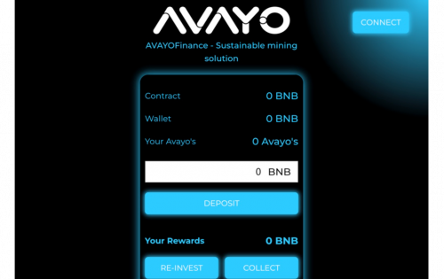
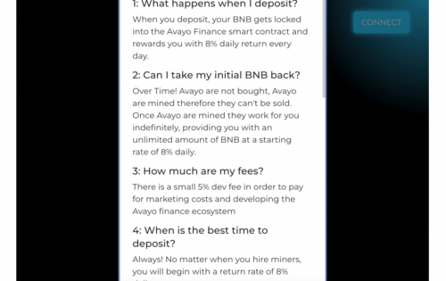

安全的 BNB 矿工，APY 高达 2,920%，以可持续的 8% 每日回报回报投资者，并提供无限的增长潜力。

我们的智能合约是完全不可变的，这意味着对象的状态在创建后无法修改。&nbsp;

我们创建了推荐系统以确保最佳数量。 分享您的推荐链接，即可从每个存款人那里获得 12% 的推荐费。

##### 1 :我存款时会发生什么？

当您存款时，您的 BNB 将被锁定在 Avayo Finance 智能合约中，并每天奖励您 8% 的每日回报。

##### 2 :我可以拿回我最初的 BNB 吗？

随着时间的推移！Avayo 不是买来的，Avayo 是开采的，因此它们不能出售。一旦 Avayo 被开采，它们就会无限期地为你工作，以每天 8% 的起始费率为你提供无限量的 BNB。

##### 3 ：我的费用是多少？

为了支付营销成本和开发 Avayo 金融生态系统，需要支付 5% 的开发费用

##### 4 :什么时候入金最好？

总是！无论您何时雇用矿工，您都将从每天 8% 的回报率开始。

##### 5 :我应该多久再投资一次（复利）？

我们建议您每天至少复利一次，但您可以随意多次进行。

##### 6 : Avayo 财务如何可持续发展？

Avayo 财务由持续的社区支持维持，就像所有其他加密货币、代币或项目一样。不同的是，既然没有代币，就没有价格可以抛售。只要Avayo在合约里挖矿，就有奖励！

