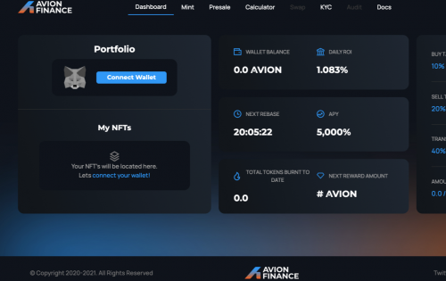

<strong>Avion Finance 是币安智能链上的 DaaS + NFT 项目。</strong>

<ul>
  <li>如果您仅持有 $AVION 代币<strong>没有 </strong>NFT，那么您将获得 5,000% 的固定 APY</li>
  <li>持有 NFT + $AVION Token 将使您的 APY 从 99,999%-399,999% 提升</li>
  <li>每 30 分钟变基一次</li>
  <li>每个钱包只能质押 1 个 NFT。在您的钱包中持有 NFT 将自动质押并自动复合您的 $AVION 代币</li>
  <li>Mint 分配暂时上限为 3，以后可能会增加。</li>
  <li><strong>只有一个 NFT</strong> 或您钱包中最高级别的 NFT 会自动质押和自动复利。</li>
  <li>有一个 15,000 NFT 集合。这是为了限制高 APY 的投资者数量。Tier 1 (99,999% APY) 80% 的机会铸造Tier 2 (199,999% APY) 15% 的机会铸造Tier 3 (399.999% APY) 5% 的机会铸造</li>
  <li>前 1500 枚铸币厂将免费获得来自 <strong>Infinite Objects 的自定义物理 NFT 可收藏视频帧</strong>。</li>
  <li><strong>Avion 的反倾销机制</strong>对于维持价格上涨行为和激励协议的道德获利回吐至关重要。这是通过将销售百分比限制为每天持有的总代币的 1% 来实现的。您可以每天卖出 1% 或持有 7 天，在第 7 天，您可以卖出 10%，直到您卖出为止。</li>
  <li>购买税率为 10%</li>
  <li>转让税设定为 40%（以避免价格操纵）</li>
  <li>销售税设定为 20%（在 WP 的税收部分中细分）</li>
  <li><strong>由财政部保护的交易范围，有助于确保真正的被动收入。交易区间将在发布前根据库存资产计算。</strong></li>
</ul>

