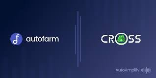

CROSS 是 Cronos 链上的自动做市商 (“AMM”)，专为稳定币和其他挂钩资产的低滑点交易而设计。

## 什么是交叉？

CROSS 是 Cronos 链上的自动化做市商（“AMM”），专为稳定币和其他挂钩资产的**低滑点交易而设计。**

第一个基本和核心流动性产品是标志性的稳定币交叉池，其中包含一篮子三个与美元挂钩的稳定币，包括 USDC、USDT、DAI。该协议打算在其他稳定币积累流动性深度（如 BUSD、UST、MIM 等）时建立额外的元池，以及与跨链协议合作的 BTC 和 ETH 等锚定蓝筹池。

此外，成为稳定币 AMM 只是第一步，CROSS 设想构建一个流动性即服务协议，稳定币质押者可以享受多元化风险调整后的高回报，单一代币质押者享受更高的收益，人人皆赢随着整个 Cronos 生态系统中实体项目的流动性深度提高。

CROSS**是非托管**的，这意味着 CROSS 开发人员无权访问您的代币

**特征**
↔️ 贸易
以尽可能低的滑点在 Cronos 链上的稳定币之间进行交换。
 **CROSS 怎么赚**
赚取 CROSS 治理代币作为在任何 CROSS 核心产品（例如稳定币交叉池）中提供稳定币流动性的奖励。
或者，CROSS 和合作伙伴 DEX Cronaswap 都对流动性提供者进行了丰厚的奖励，以帮助减轻无常损失。 您可以在 CROSS 平台或 Cronaswap 的农场中质押 CROSS-xUSD LP

