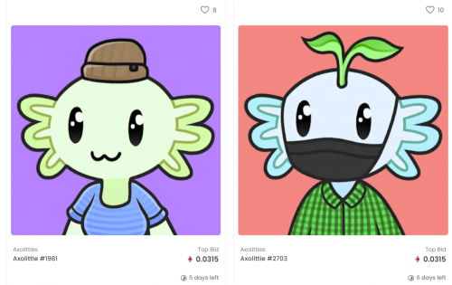
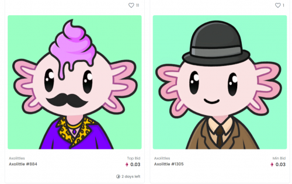

---
title: "Axolittles"
description: "• Axolittles，最丰富多彩的 NFT 收藏。
• 10,000 个独特的动画收藏品."
date: 2022-08-18T00:00:00+08:00
lastmod: 2022-08-18T00:00:00+08:00
draft: false
authors: ["crazyxuanshao"]
featuredImage: "axolittles.png"
tags: ["Collectibles","Axolittles"]
categories: ["nfts"]
nfts: ["Collectibles"]
blockchain: "ETH"
website: ""
twitter: "https://twitter.com/AxolittlesNFT"
discord: "https://discord.com/invite/axolittlesnft"
telegram: ""
github: ""
youtube: "https://www.youtube.com/channel/UCAl52HSQ2mDw_MfevcuiIZg"
twitch: ""
facebook: ""
instagram: ""
reddit: ""
medium: "https://medium.com/@axolittles"
steam: ""
gitbook: ""
googleplay: ""
appstore: ""
status: "Live"
weight: 
lightgallery: true
toc: true
pinned: false
recommend: false
recommend1: false
---

Axolittles 是 10,000 件由算法生成的艺术品的集合，由 160 多个特征组合而成。 他们的灵感来自世界上最可爱的两栖动物蝾螈。 每个 Axolittle 都有动画，并带有一个 48 帧的 GIF，可以完美循环，让您可以盯着它看几个小时！

# 探索蝾螈

蝾螈是通往令人惊叹的生态系统的通行证。我们正在创建您想要加入的虚拟世界和数字社区。我们项目的影响并不止于元界。薄荷收益的一部分捐赠给了一个帮助世界各地水净化的慈善机构。

加入我们并留下您的印记，在重大决策上与我们一起投票，在我们即将推出的网页游戏中解锁独家物品，更重要的是，成为我们迷人社区的一部分。

# 什么是蝾螈？

被团队 100% 的母亲投票选为最可爱的*NFT* ……认识蝾螈，这是最早的动画 NFT 项目之一，灵感来自最可爱的动物：蝾螈。我们希望您喜欢这些数字动物，就像我们喜欢创造它们一样。它们很可爱，充满活力，而且是完美的头像。这 10,000 个 Axolittle 中的每一个都是生成的具有 160 多个特征的艺术品，这意味着每个单独的 Axolittle 都是完全独一无二的。

尽管我们的社区很大，但我们希望将其发展得更大。今天，我们正在为这些数字生物寻找潜在的家园

