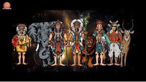

---
title: "Aztec King"
description: "多彩，有趣和酷！"
date: 2022-08-18T00:00:00+08:00
lastmod: 2022-08-18T00:00:00+08:00
draft: false
authors: ["crazyxuanshao"]
featuredImage: "aztec-king.png"
tags: ["High risk","Aztec King"]
categories: ["nfts"]
nfts: ["High risk"]
blockchain: "BSC"
website: "https://aztec-kingdom.com/?utm_source=DappRadar&utm_medium=deeplink&utm_campaign=visit-website"
twitter: "https://twitter.com/Atcecking"
discord: "https://discord.gg/qwgDqvcCSU"
telegram: "https://t.me/+FBvM8y7qdpEyMmFl"
github: ""
youtube: ""
twitch: ""
facebook: ""
instagram: ""
reddit: ""
medium: ""
steam: ""
gitbook: ""
googleplay: ""
appstore: ""
status: "Live"
weight: 
lightgallery: true
toc: true
pinned: false
recommend: false
recommend1: false
---

相传，阿兹特克人的祖先来自北方一个叫阿兹特克人的地方。 他们按照太阳神惠兹洛波切特里的指示，向南前往阿纳瓦克山谷的特斯科科湖。 当他们来到湖中央的小岛时，他们看到一只老鹰和一条蛇栖息在仙人掌上。 这个现象告诉他们应该在这里建城。 因此，1325 年，阿兹特克人在这个地方建造了特诺奇蒂特兰，一个巨大的人工岛

**市场**

将有一个内部 NFT 市场，玩家将通过交易出售或改善他们的经济。以任何形式利用市场进行这些交易将产生 15% 的税收，这些税收将返还到奖金池中。市场将使用 ATC 作为其默认代币。

**NFT 挖矿**

英雄卡是游戏的NFT资产，可以通过开启神秘卡获得或者通过NFT市场购买。

英雄卡可用于游戏、挖矿和游戏。

玩家抽到英雄后，系统会自动质押并开始挖矿ATC，每天产生收益。

收益分配取决于平台上用户总算力的平均值。简而言之，随着计算示例数量的增加，收益也会增加。在质押挖矿的过程中，用户可以浏览自己的算力和平台的总算力。算力决定了每天的挖矿收益。

