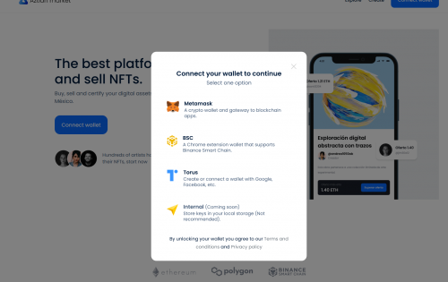
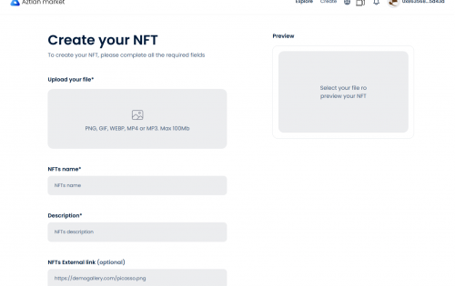

Aztlan Market 是一个专注于拉丁美洲市场的 NFT 市场，我们是在墨西哥领土开发的第一个 NFT 平台，我们 100% 致力于让普通人更容易使用区块链技术，我们专注于用户体验 在用户教育方面，我们坚信人们必须进行一次重大的思维飞跃，才能了解 NFT 可以为他们的生活带来的影响和好处。 我们是本地区的先驱，我们了解市场和人民的需求，这使我们能够开始建立一个本地艺术家社区，他们渴望在我们的平台上铸造、展示和销售他们的作品。

### 创建和出售你的 NFT

开始销售自己的 NFT 非常快速和容易，请按照以下步骤发布您的第一个 NFT 。

**连接你的钱包**

创建或连接您的首选钱包并将其连接到 Azltan Market 。

**添加你的 NFT**

上传您的艺术作品（图像、视频、音频或 3D），添加标题、描述、类别。

**开始卖**

您选择如何出售您的 NFT，您可以选择固定价格或拍卖它。

