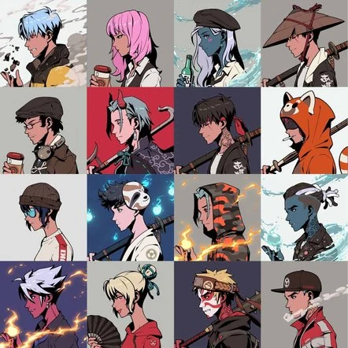

Azuki 从收集 10,000 个化身开始，让您可以访问 The Garden：互联网的一个角落，艺术家、建设者和 web3 爱好者在这里聚会，创造一个去中心化的未来。 Azuki 持有者可以获得独家掉落、体验等。&nbsp;

## **什么是 Azuki NFT？** 

Azuki 是一个数字品牌，主要与 2022 年 1 月 12 日洛杉矶的一组艺术家发布的 10,000 个头像有关。

这些头像以动漫为主题绘制，具有独特的特点，引起了全球NFT爱好者的关注。

拥有 Azuki 后，用户可以在成为*The Garden*成员时访问独家 NFT 掉落、街头服饰合作、现场活动等。创作者将这个地方描述为 

> “互联网一角，艺术家、建设者和 web3 爱好者聚集在一起，创造一个去中心化的未来。”

所有的 Azukies 在头发、背景、衣服和不同的可穿戴设备方面都有不同的特征——有些 Azukies 拿着剑、一杯咖啡、滑板或 Boombox。这是一些例子：

