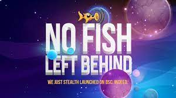

池 stabelcoin 流动性允许资金跨链无缝流动。

# 关于

BabelFish DAO 货币协议是 DeFi 宇宙中最简单、最有用的东西。它吸收、聚合和跨链分配与美元挂钩的稳定币；这一切的实际结果是，如果你将稳定币粘在上面，你可以巧妙地跨越任何链之间的语言鸿沟。BabelFish 的元稳定币 XUSD 得到底层聚合稳定币的支持，以利用和增强它们跨协议和用户的综合流量和效用。FISH 持有者可以对改进提案进行投票，例如接受哪些稳定币，或者借出多少百分比的抵押品。

#### 什么让 BabelFish 动起来

对“去信任的稳定币翻译设备”的需求似乎非常清楚。加密货币的加速增长和速度是不可阻挡的，我们预计随着我们首批十亿用户的加入，对可编程货币的需求将继续加速。但市场仍然分散，两个参与者占据了美元稳定币总流通量的 80% 以上，系统性和特殊风险比比皆是。在去中心化经济中，我们不应该依赖一两个美元稳定币的发行者，而应该让一千个稳定币开花并相互交流以带来大规模采用。对于 BabelFish DAO 货币协议，重要的是我们的第一个产品 XUSD 是加密空间中最安全、最简单和终极的稳定币工具。

