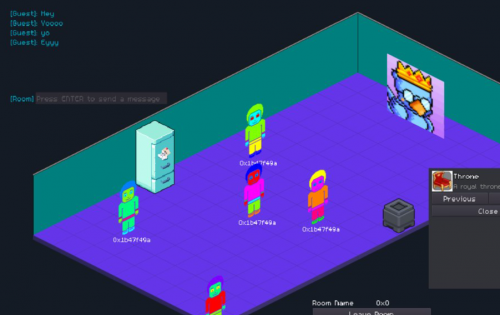

MMO 虚拟房间构建器，用户可以在其中导入并显示他们房间内其他生态系统的现有 NFT，并与朋友一起享受。 Babilu 专注于提供一种通过使用战利品盒来赚取结构的游戏。 DARIC 我们内部的通缩游戏代币。&nbsp;

用户还可以通过智能合约在游戏中以 P2P 方式交易/赌博 NFT利用 VRF 机制获得可证明的公平结果。用户可以通过游戏内活动获得 NFT 1155 的战利品箱，然后将这些战利品箱打开或出售给其他人。&nbsp;

可以通过燃烧内部游戏代币 DARIC 来打开战利品箱，一旦通过智能合约打开，战利品箱就会包含一个随机 NFT 物品，这些物品来自用户可以在其房间内放置和使用的物品“集合”。额外的收藏和掉落将通过社区驱动的比赛和赞助活动。

该平台将利用 ICP 进行所有底层房间连接，以确保游戏的完全去中心化，同时提供可在我们的智能合约中使用的替代 VRF 提供商，例如 ChainLink。

