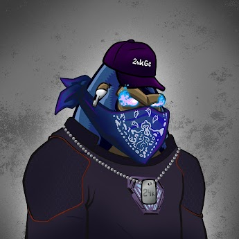

项目网站、社交联系方式、项目介绍内容详见：https://opensea.io/collection/bullitprimegorillas

##### ▶ 什么是 Bullit prime Gorillas 帮派？

Bullit prime Gorillas gang 是一个 NFT（不可替代令牌）集合。存储在区块链上的数字艺术品集合。

##### ▶ 存在多少 Bullit prime Gorillas gang 代币？

总共有 2,425 个 Bullit prime Gorillas gang NFT。目前，69 位车主的钱包中至少有一个 Bullit prime Gorillas gang NTF。

##### ▶ 最近卖出了多少 Bullit prime Gorillas 帮派？

过去 30 天内售出 0 个 Bullit Prime Gorillas gang NFT。

截止至8月28日

2.4K**项目**

69**拥有者**

0.53**总容积**

1**底价**