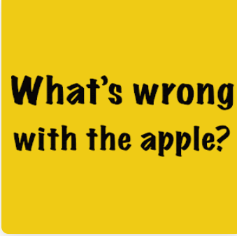

项目网站、社交联系方式、项目介绍内容详见：https://opensea.io/collection/bullshitters-lol

##### 

Bullshit NFT 是一个 NFT（非同质代币）集合。存储在区块链上的数字艺术品集合。

##### ▶ Bullshit NFT 代币有多少？

总共有 100 个 Bullshit NFT NFT。目前，12 位所有者的钱包中至少有一个 Bullshit NFT NTF。

##### ▶ 最近卖出了多少 Bullshit NFT？

过去 30 天内售出 0 个 Bullshit NFT NFT。

截止至8月28日

3.3K**项目**

1.5K**拥有者**

0.13**总容积**

<0.01**底价**

