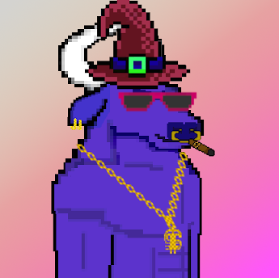

项目网站、社交联系方式、项目介绍内容详见：https://opensea.io/collection/bully-bulls-billionaires

##### ▶ 什么是 Bully Bulls 亿万富翁？

Bully Bulls Billionaires 是一个 NFT（不可替代代币）集合。存储在区块链上的数字艺术品集合。

##### ▶ 存在多少 Bully Bulls Billionaires 代币？

总共有 18 个 Bully Bulls 亿万富翁 NFT。目前 2 位所有者的钱包中至少有一个 Bully Bulls Billionaires NTF。

##### ▶ 最近卖出了多少 Bully Bulls 亿万富翁？

.png)

过去 30 天内共售出 0 个 Bully Bulls Billionaires NFT。

截止至8月28日

18**项目**

2**拥有者**

0.01**总容积**

0.01**底价**