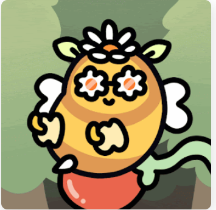

项目网站、社交联系方式、项目介绍内容详见：https://opensea.io/collection/bumble-beens-nft

##### ▶ 什么是 Crypto Bees NFT？

Crypto Bees NFT 是一个 NFT（不可替代令牌）集合。存储在区块链上的数字艺术品集合。

##### ▶ 存在多少 Crypto Bees NFT 代币？

总共有 50 个 Crypto Bees NFT NFT。目前，75 位所有者的钱包中至少有一个 Crypto Bees NFT NTF。

##### ▶ 最近卖出了多少 Crypto Bees NFT？

过去 30 天内售出 0 个 Crypto Bees NFT NFT。

**Crypto Bees NFT** - 是生活在 Polygon 区块链上的 50 只大黄蜂（每只 10:1，总共 500 只）的集合。🐝🪁

蜜蜂是地球上最重要的物种，所以你的#MetaVerse 中必须要有一个

截止至8月28日

10.0K**项目**

987**拥有者**

0.30**总容积**

<0.01**底价**