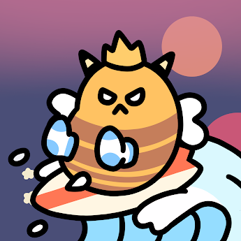

##### ▶ 什么是大黄蜂？

Bumble Beens 是一个 NFT（不可替代代币）集合。存储在区块链上的数字艺术品集合。

##### ▶ 有多少 Bumble Beings 代币？

总共有 360 个 Bumble Beings NFT。目前，121 位车主的钱包中至少有一个 Bumble Beings NTF。

##### ▶ 最昂贵的 Bumble Beings 销售是什么？

出售的最昂贵的 Bumble Beens NFT 是 Bumble Been #93。它于 2022-07-01（大约 2 个月前）以 98.8 美元的价格售出。

##### ▶ 最近卖出了多少 Bumble Beings？

过去 30 天内售出了 33 个 Bumble Beings NFT。

##### ▶ Bumble Beings 的价格是多少？

在过去 30 天内，最便宜的 Bumble Beings NFT 销售额低于 30 美元，最高销售额超过 72 美元。在过去 30 天内，Bumble Beens NFT 的中位价格为 40 美元。

.png)

截止至8月28日

360**项目**

124**拥有者**

1.4**总容积**

0.01**底价**