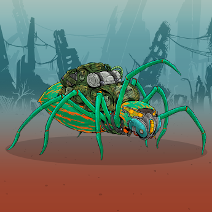

##### ▶ 什么是碉堡野兽？

Bunker Beasts 是一个 NFT（非同质代币）集合。存储在区块链上的数字艺术品集合。

##### ▶ 地堡野兽代币有多少？

总共有 4,007 个 Bunker Beasts NFT。目前 858 位车主的钱包中至少有一个 Bunker Beasts NTF。

##### ▶ 最昂贵的 Bunker Beasts 销售是什么？

Bunker Beasts NFT 售出的最贵的是 . 它于 2022-08-25（3 天前）以 7 美元的价格售出。

##### ▶ 最近卖出了多少碉堡兽？

过去 30 天内售出了 3 个 Bunker Beasts NFT。

.png)

截止至8月28日

4.0K**项目**

857**拥有者**

33.6**总容积**

<0.01**底价**