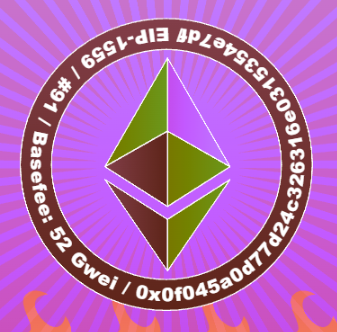
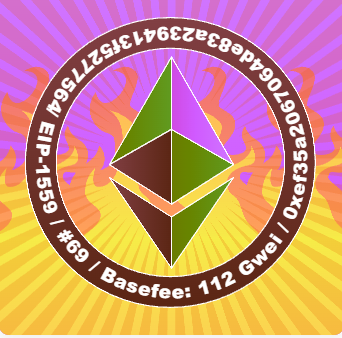

##### ▶ 什么是 BurnyBoy？

BurnyBoy 是一个 NFT（不可替代代币）集合。存储在区块链上的数字艺术品集合。

##### ▶ 有多少 BurnyBoy 代币？

总共有 1,344 个 BurnyBoy NFT。目前，677 位车主的钱包中至少有一个 BurnyBoy NTF。

##### ▶ 最近卖出了多少 BurnyBoy？

过去 30 天内售出 0 个 BurnyBoy NFT。

截止至8月28日

1.3K**项目**

678**拥有者**

0.83**总容积**

0.01**底价**