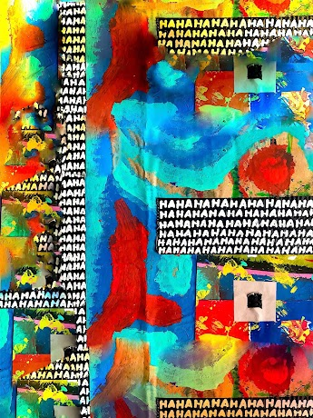
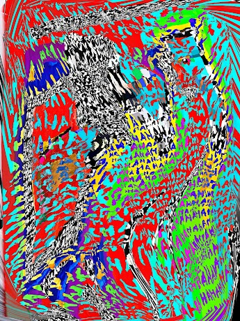

项目网站、社交联系方式、项目介绍内容详见：https://opensea.io/collection/burst

##### ▶ 什么是突发日光灼伤？

爆裂日光burnsun 是一个NFT（非同质代币）集合。存储在区块链上的数字艺术品集合。

##### ▶ 有多少爆发的日光燃烧代币？

总共有 1 个突发日光燃烧 NFT。目前有 2 位车主的钱包中至少有一个突发日光灼伤 NTF。

##### ▶ 最近卖出了多少突发日光？

过去 30 天内售出 0 个突发日光燃烧 NFT。

截止至8月28日

11**项目**

8**拥有者**

2.5**总容积**