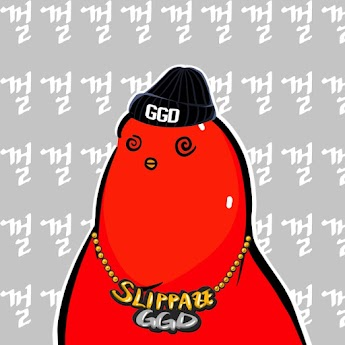

**你好。这是 Cherbirds 团队的 Cyan。**

期待已久的首个 NFT 项目“BUZZ FAMILY”即将上线！

虽然官方发布和铸造时间表尚未最终确定，但我们正在进行最终检查，以便我们可以在 12 月发布。

Buzz Family 是一款 PFP NFT，外形为一只可爱的鹦鹉，拥有 180 多种不同的零件和配件，展现了它的各种个性。

.jpg)

详细发行计划如下。

# **发行数量**

**总计 10,000**

┗ 团队锁定：1,500
┗ 营销与合作：500
┗ 119 奖励：600
┗ Chettteok Holder Airdrop：1,000
┗ Clay 销售：3,200
┗ Chettteok 销售：3,200

有意见认为之前公布的发行分配方案中开发团队的比例过大，所以我们将团队数量减半，准备让更多人参与铸币。

持币人119奖励和空投的详细进展我们会尽快通知大家。

# **铸币价格**

**15 克莱或 5000 GGD**

铸币可以用 GGD 或 KLAY 玩。通过对每个矿池应用不同的 Minting Table，使用 GGD 参与 Minting 的用户可以获得稀有度更高的 NFT。

