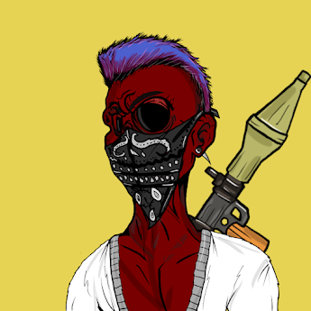

当您将 BZC Zombies 放入即将到来的 Strongholds 大逃杀游戏中时，您将永远不一样。

土地出售- 现在铸币！

查看我们的系列并立即加入#BZCArmy！

僵尸丨国王丨二维建丨3D建丨元界丨元晶体丨土地

.png)

##### ▶ 什么是亿万富翁僵尸俱乐部？

亿万富翁僵尸俱乐部是一个 NFT（不可替代令牌）集合。存储在区块链上的数字艺术品集合。

##### ▶ 亿万富翁僵尸俱乐部代币有多少？

总共有 10,000 个亿万富翁僵尸俱乐部 NFT。目前，3,459 名所有者的钱包中至少有一个 Billionaire Zombies Club NTF。

##### ▶ 亿万富翁僵尸俱乐部最昂贵的交易是什么？

售出的最昂贵的亿万富翁僵尸俱乐部 NFT 是 #5025。它于 2022-08-26（3 天前）以 211 美元的价格售出。

##### ▶ 最近卖出了多少亿万富翁僵尸俱乐部？

过去 30 天内售出了 76 个亿万富翁僵尸俱乐部 NFT。

##### ▶ 亿万富翁僵尸俱乐部的费用是多少？

在过去 30 天里，最便宜的 Billionaire Zombies Club NFT 销售额低于 24 美元，最高销售额超过 108 美元。过去 30 天，Billionaire Zombies Club NFT 的中位价格为 30 美元。

