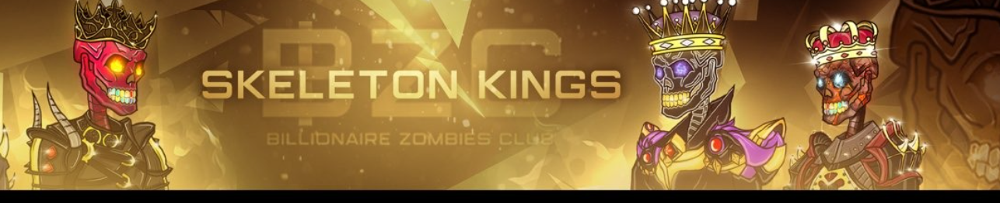

##### ▶ 什么是 BZC 万能钥匙？

BZC Skeleton Keys 是一个 NFT（不可替代令牌）集合。存储在区块链上的数字艺术品集合。

##### ▶ 存在多少个 BZC 万能钥匙代币？

总共有 506 个 BZC Skeleton Keys NFT。目前，409 位所有者的钱包中至少有一个 BZC 万能钥匙 NTF。

##### ▶ 最近卖出了多少 BZC 万能钥匙？

过去 30 天内共售出 0 个 BZC Skeleton Keys NFT。

.png)

**截止至8月29日**

733**项目**

527**拥有者**

11.1**总容积**

0.02**底价**