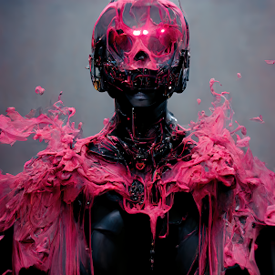

**taylor.wtf 是一位住在面包车里的数字游民，自 2017 年 NFT 艺术界诞生以来，他收集了他的 Cryptopunk。**

他的作品曾在洛杉矶、香港和迪拜的画廊展出。他与 Pussy Riot 和 MF Doom 等艺术家以及 Mindds 的 Dario De Siena 合作过。 

.png)

taylor.wtf 是 cakeed apes 的创始人，这是一个 8888 件生成艺术收藏品，在 15 秒内售罄，销售额超过 200 万美元。

他创立了 discord.art，这是一个发起多个项目的艺术家集体社区，是许多 NFT 艺术家和项目起步的基础。 

他还创立了 WTF.INDUSTRIES，这是一家 NFT 制作工作室，将于 6 月 20 日星期一发布他们与 Monaverse 合作的第一个 Metaverse 项目的预告片

现在他正在推出 COOKIE.CLUB，它将在不同的活动中与他的收藏家一起提供饼干和商品。COOKIE.CLUB 的计划还有很多，但 taylor.wtf 对他的工作非常保密