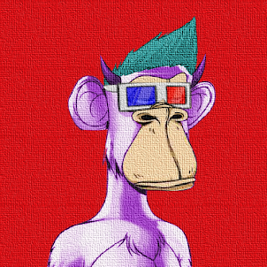

.png)

##### ▶ 什么是画布猿？

Canvas Apes 是一个 NFT（不可替代令牌）集合。存储在区块链上的数字艺术品集合。

##### ▶ 存在多少 Canvas Apes 代币？

总共有 1,000 个 Canvas Apes NFT。目前，364 位所有者的钱包中至少有一个 Canvas Apes NTF。

##### ▶ 最近卖出了多少 Canvas Apes？

过去 30 天内售出 0 个 Canvas Apes NFT。

**截止至8月30日**

1.0K**项目**

364**拥有者**

13.2**总容积**

<0.01**底价**