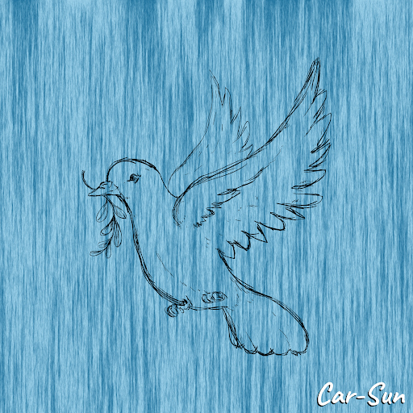

.png)

##### ▶ 什么是 Car-Sun 系列？

Car-Sun Collection 是一个 NFT (Non-fungible token) 集合。存储在区块链上的数字艺术品集合。

##### ▶ Car-Sun Collection 代币有多少？

总共有 3 个 Car-Sun Collection NFT。目前 7 位车主的钱包中至少有一个 Car-Sun Collection NTF。

##### ▶ Car-Sun Collection 最昂贵的销售是什么？

售出的最昂贵的 Car-Sun Collection NFT 是 Howl。它于 2022-06-19（2 个月前）以 11 美元的价格售出。

##### ▶ Car-Sun Collection 最近卖出了多少？

过去 30 天内售出了 4 个 Car-Sun Collection NFT。

**截止至8月30日**

3**项目**

7**拥有者**

0.04**总容积**

<0.01**底价**