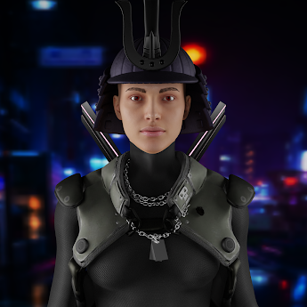

项目网站、社交联系方式、项目介绍内容详见：https://opensea.io/collection/bushido7077nft

.png)

7077 年，也就是冰川盆地崩塌数千年后，进化进入了一个杂交物种主导地球表面的新时代。阿尔法零被任命为最高权威，对这片土地拥有绝对的权力。

随着机器人崛起为政治力量的地位，他们对行使更大权力的贪得无厌的渴望和贪婪迫使机器人转而反对联邦。

来自 Yurei 被遗弃氏族的机器人 Jin 领导了反抗统治阶级的叛乱。

##### ▶ 什么是 Bushido7077 NFT？

Bushido7077 NFT 是一个 NFT（Non-fungible token）集合。存储在区块链上的数字艺术品集合。

##### ▶ 有多少个Bushido7077 NFT 代币？

总共有 270 个 Bushido7077 NFT NFT。目前 120 位所有者的钱包中至少有一个 Bushido7077 NFT NTF。

##### ▶ 最近卖出了多少个Bushido7077 NFT？

过去 30 天内共售出 0 个 Bushido7077 NFT NFT。