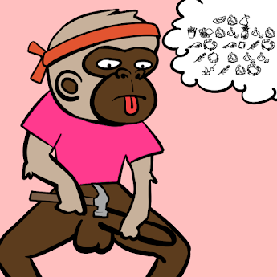

项目网站、社交联系方式、项目介绍内容详见：https://opensea.io/collection/buy-this-nft-or-apell-do-it

.png)

##### ▶ 什么是买这个 NFT 或 Ape'll do it？

购买此 NFT 或 Ape'll do it 是 NFT（不可替代令牌）集合。存储在区块链上的数字艺术品集合。

##### ▶ 有多少 Buy this NFT 或 Ape'll do it 代币存在？

总共有 1,380 个购买这个 NFT 或 Ape'll do it NFT。目前 198 位所有者的钱包中至少有一个 Buy this NFT 或 Ape'll do it NTF。

##### ▶ 最近卖出了多少 Buy this NFT or Ape'll do it？

过去 30 天内售出了 1 个购买此 NFT 或 Ape'll do it NFT。

**截止至8月29日**

1.4K**项目**

198**拥有者**

0.02**总容积**