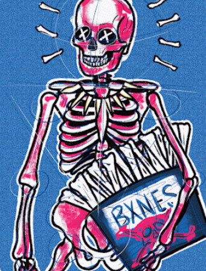

项目网站、社交联系方式、项目介绍内容详见：https://opensea.io/collection/bxnes-collection-v3

##### ▶ 什么是 Bxnes 索赔收集？

Bxnes Claim Collection 是一个 NFT (Non-fungible token) 集合。存储在区块链上的数字艺术品集合。

##### ▶ 存在多少个 Bxnes Claim Collection 代币？

总共有 164 个 Bxnes Claim Collection NFT。目前，117 位所有者的钱包中至少有一个 Bxnes Claim Collection NTF。

##### ▶ 最昂贵的 Bxnes Claim Collection 销售是什么？

出售的最昂贵的 Bxnes Claim Collection NFT 是 Down Bad。Bxnes 向上]。它于 2022-06-18（2 个月前）以 197.6 美元的价格售出。

##### ▶ 最近卖出了多少 Bxnes Claim Collection？

过去 30 天内售出了 7 个 Bxnes Claim Collection NFT。

**截止至8月29日**

164**项目**

118**拥有者**

1.3**总容积**

<0.01**底价**