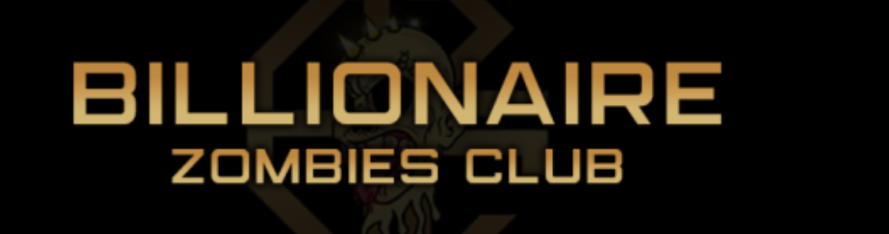
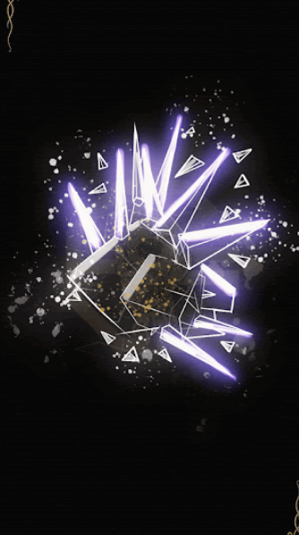

项目网站、社交联系方式、项目介绍内容详见：https://opensea.io/collection/bzcmetacrystal

10,000 个独特的富豪僵尸作为 ERC-721 代币存储在与以太坊兼容的 Polygon 网络上。所有僵尸都托管在 IPFS 上

##### ▶ 什么是 BillionairesZombieClub？

BillionairesZombieClub 是一个 NFT（不可替代代币）集合。存储在区块链上的数字艺术品集合。

##### ▶ 有多少 BillionairesZombieClub 代币？

总共有 21 个 BillionairesZombieClub NFT。目前 2 位所有者的钱包中至少有一个 BillionairesZombieClub NTF。

##### ▶ 最近卖出了多少 BillionairesZombieClub？

过去 30 天内售出了 0 个 BillionairesZombieClub NFT。

