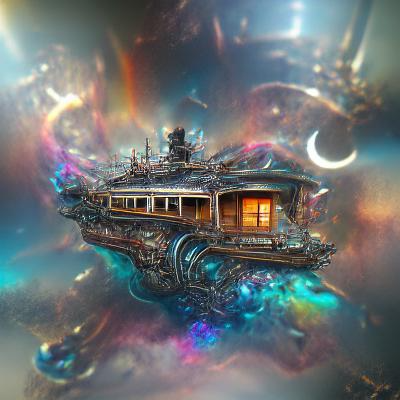

项目网站、社交联系方式、项目介绍内容详见：https://opensea.io/collection/cabins-in-the-cosmos

777个充满神秘感、生成精美的宇宙小屋漂浮在整个宇宙中。

实用性以精美的艺术品形式提供，供心灵感知。

TEGA BRAIN 的创意指导制作

.png)

**截止至8月29日**

777**项目**

232**拥有者**

0.06**总容积**

<0.01**底价**