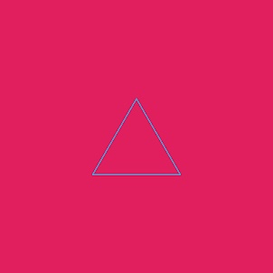

项目网站、社交联系方式、项目介绍内容详见：https://opensea.io/collection/calcinationpolygonbeta

##### ▶ 什么是煅烧多边形 Beta？

Calcination Polygon Beta 是一个 NFT（不可替代代币）集合。存储在区块链上的数字艺术品集合。

##### ▶ 存在多少个煅烧多边形 Beta 代币？

总共有 11 个煅烧多边形 Beta NFT。目前 2 位所有者的钱包中至少有一个 Calcination Polygon Beta NTF。

##### ▶ 最近卖出了多少Calcination Polygon Beta？

过去 30 天内售出 0 件 Calcination Polygon Beta NFT。

**截止至8月29日**

11**项目**

2**拥有者**

0.01**总容积**