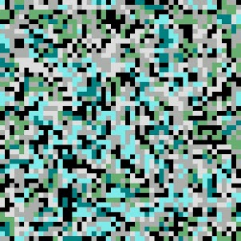
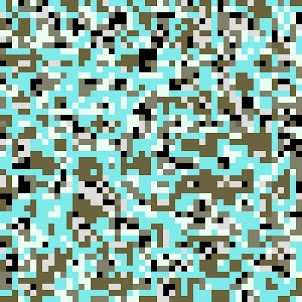

项目网站、社交联系方式、项目介绍内容详见：https://opensea.io/collection/camosplinters

该系列由 CAMO LABEL 精选的 NFT 组成。这些展示了我们打算用 NFT 构建和表达的内容。请享受我们制作独家艺术品的愿景和努力。

##### ▶ 什么是 CAMO LABEL 系列？

CAMO LABEL Collections 是一个 NFT（非同质代币）集合。存储在区块链上的数字艺术品集合。

##### ▶ 有多少 CAMO LABEL Collections 代币？

总共有 15 个 CAMO LABEL Collections NFT。目前 2 位所有者的钱包中至少有一个 CAMO LABEL Collections NTF。

##### ▶ 最近售出了多少 CAMO LABEL 系列？

在过去 30 天内售出 0 个 CAMO LABEL Collections NFT。